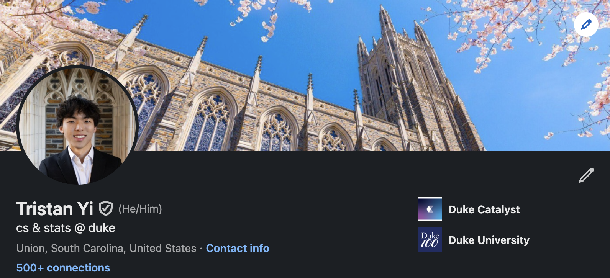

  

  <h1>Hi 👋, I'm Tristan!</h1>
  <h3>Undergraduate Student @ Duke University</h3>

  

    
    
    
  

---

### 🔧 Languages & Tools

  
  
  
  
  
  
  
  

---

### 🧭 About

- Building full‑stack apps with React/Next.js, Node/Express, and Postgres
- Passionate about photography and traveling — see the interactive map on my portfolio
- Always learning, always shipping

---

### 📬 Contact

- Email: <a href="mailto:tristan.yi@duke.edu">tristan.yi@duke.edu</a>
- LinkedIn: <a href="https://www.linkedin.com/in/tristan-yi/" target="_blank">/in/tristan-yi</a>
- Portfolio: <a href="https://tristanyi.com" target="_blank">tristanyi.com</a>
