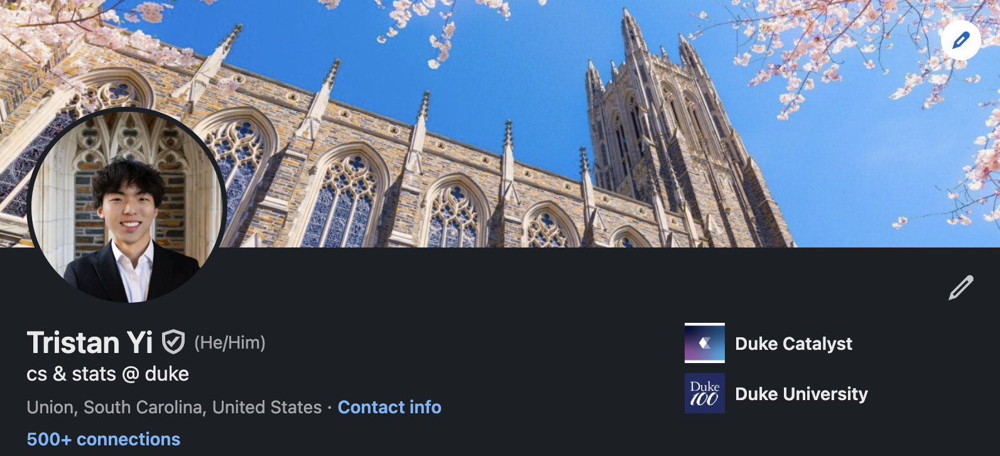

  
  
  <h1>Tristan Yi</h1>
  
<b>Computer Science & Statistics @ Duke University</b>

  

    
  

  
  

    <a href="https://www.linkedin.com/in/tristan-yi/">LinkedIn</a> • 
    <a href="mailto:tristan.yi@duke.edu">Email</a> • 
    <a href="https://tristanyi.com/">tristanyi.com</a>
  

---

### 🚀 The Pulse

  

---

### 🔧 Tech Ecosystem

**Languages:** `Python` • `Java` • `C` • `TypeScript` • `JavaScript` • `Swift`

**Frameworks:** `Flask` • `FastAPI` • `Node.js` • `Next.js` • `React Native` • `Selenium`

**Infra & Data:** `PostgreSQL` • `MongoDB` • `Neo4j` • `Redis` • `AWS` • `Docker`

**Concepts:** `Backend` • `Systems` • `Machine Learning` • `NLP` • `SDLC`

---

  
Currently working @ <b>Verlo AI, Kalshi</b>

  </a>

